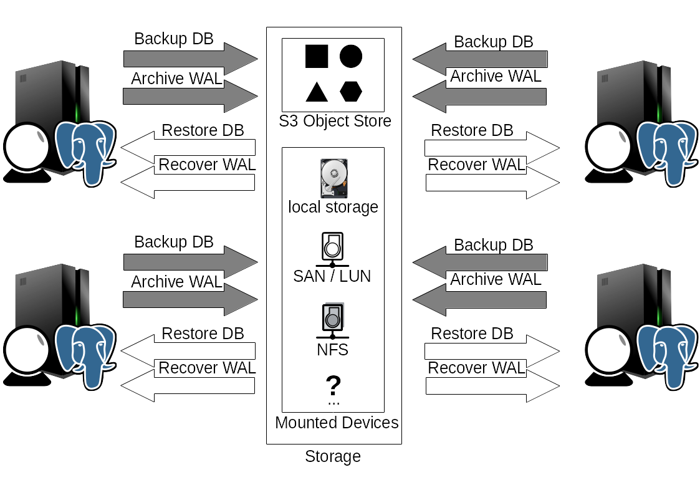

[](https://circleci.com/gh/xxorde/pgglaskugel)
[](https://travis-ci.org/xxorde/pgglaskugel)
[](https://goreportcard.com/report/github.com/xxorde/pgglaskugel)


# Disclaimer

This is a personal work-in-progress project!
Do not expect anything to work as intended, yet!

Feel free to send bug reports, use `--debug`! :)

# pgGlaskugel

This should become an easy to use (backup) tool for PostgreSQL.

## Design
The tool should have an easy to use CLI (like git / docker) and can also be automated easy as well.

### Configuration
The configuration should be easy to use and manage.

### Setup

Comes with a simple self setup.

### Archive
Can be used to archive to:
* local storage / network mounts
* S3 / minio


# Example architecture

## Distributed or Single Node


This is a distributed or single node approach, it is the intended use case for pgGlaskugel.
On every database server there is also an instance of pgGlaskugel.

Local storage or network mounts are accessed through the local file system.
S3 compatible object storage can be accessed by pgGlaskugel directly.

### Backup
Backups are done by calling `pgGlaskugel basebackup`. This can happen manually, via cronjob or an automation tool like Ansible.

### WAL Archiving
If WAL Archiving should be used, PostgreSQL's `archive_command` is set to `pgGlaskugel archive %p` so that PostgreSQL calls it for every ready WAL file.

### Retention Policy
Retention policy is enforced by calling `pgGlaskugel cleanup --retain <NUMBER OF BACKUPS TO KEEP> --force-retain`.
This is normally done via cronjob on the same machine (but there are also other methods).

### Restore Backup
Backups are restored by a local call to `pgGlaskugel  restore --backup <BACKUP NAME> --restore-to <PATH TO NEW INSTANCE>`


## Centralized Backup Server


This example uses a central backup server that manages the backups of many database servers.
This is not the intended use so this kind of setup is not as convenient.

### Backups
Backups are called via cronjob or another tool according to schedule.
For every server to backup there is a different config file.
```yaml
pgglaskugel --config server_to_backup.yml basebackup
```

Orchestration will maybe integrated later. 

### WAL Archiving
If WAL Archiving should be used, PostgreSQL's `archive_command` is set to `pgGlaskugel archive %p` so that PostgreSQL calls it for every ready WAL file.
Because WAL is pushed by PostgreSQL, access to the WAL storage from database server is necessary.

If pgGlaskugel should not be installed, the WAL segments can be compressed and transferred by other methods.


# Usage
```
A tool that helps you to manage your PostgreSQL backups.
     __________
    /          \
   /   ______   \
  /   /     0\   \
 /   /        \   \
 \   \        /   /
  \   \______/   /
   \  /______\  /
    \__________/

Usage:
  pgglaskugel [command]

Available Commands:
  archive     Archives given WAL file(s)
  basebackup  Creates a new basebackup from the database
  cleanup     Deletes backups and WAL files enforcing an retention policy
  fetch       Fetches a given WAL file
  genman      Generate man page for pgGlaskugel
  help        Help about any command
  ls          Shows existing backups
  lswal       Show all WAL files in archive
  restore     Restore an existing backup to a given location
  setup       Setup PostgreSQL and needed directories.
  tutor       A small tutorial to demonstrate the usage
  version     Shows the version of pgGlaskugel you are using

Flags:
      --archive_to string           WAL destination (file|s3) (default "file")
      --archivedir string           Dir where the backups (default "/var/lib/postgresql/backup/pgglaskugel")
      --backup_to string            Backup destination (file|s3) (default "file")
      --cluster_name string         Name of the cluster, used in backup name (default "kerrigan")
      --config string               Config file
      --connection string           Connection string to connect to the database (default "host=/var/run/postgresql user=postgres dbname=postgres")
      --debug                       Enable debug mode to increase verbosity
      --encrypt                     Enable encryption for S3 storage
  -j, --jobs int                    The number of jobs to run parallel. default depends on cores  (default 4)
      --json                        Generate output as JSON
      --path_to_basebackup string   Path to the basebackup command (default "/usr/bin/pg_basebackup")
      --path_to_gpg string          Path to the gpg command (default "/usr/bin/gpg")
      --path_to_tar string          Path to the tar command (default "/bin/tar")
      --path_to_zstd string         Path to the zstd command (default "/usr/bin/zstd")
      --path_to_zstdcat string      Path to the zstdcat command (default "/usr/bin/zstdcat")
  -D, --pgdata string               Base directory of your PostgreSQL instance aka. pg_data (default "$PGDATA")
      --pgdata-auto                 Try to find pgdata if not set correctly (via SQL) (default true)
      --recipient string            The recipient for PGP encryption (key identifier) (default "pgglaskugel")
      --s3_access_key string        access_key (default "TUMO1VCSJF7R2LC39A24")
      --s3_bucket_backup string     Bucket name for base backups (default "pgglaskugel-basebackup")
      --s3_bucket_wal string        Bucket name for WAL files (default "pgglaskugel-wal")
      --s3_endpoint string          S3 endpoint (default "127.0.0.1:9000")
      --s3_location string          S3 datacenter location (default "us-east-1")
      --s3_protocol_version int     Version of the S3 protocol version (2,4,-1=auto) (default -1)
      --s3_secret_key string        secret_key (default "yOzp7WVWOs9mFeqATXmcQQ5crv4IQtQUv1ArzdYC")
      --s3_ssl                      If SSL (TLS) should be used for S3 (default true)

Use "pgglaskugel [command] --help" for more information about a command.
```


# Encryption
Encryption is delegated to GnuPG
```
# generate keys
gpg --gen-key
```

# Binary
Binaries are created by circleci for EVERY commit, expect them to be broken!
* Binary only [pgglaskugel](https://circleci.com/api/v1/project/xxorde/pgglaskugel/latest/artifacts/0/$CIRCLE_ARTIFACTS/pgglaskugel?circle-token=cb916b323f139fb7097f26dfca10267b1c9701a4)
* Compressed [pgGlaskugel.tar.xz](https://circleci.com/api/v1/project/xxorde/pgglaskugel/latest/artifacts/0/$CIRCLE_ARTIFACTS/pgGlaskugel.tar.xz?circle-token=cb916b323f139fb7097f26dfca10267b1c9701a4)

# Build
Have a look at https://golang.org/doc/code.html

Setup go build environment.

```
# install Go >= 1.8
mkdir $HOME/work
export GOPATH=$HOME/work
export PATH=$PATH:$GOPATH/bin
```

Install pgglaskugel.

```
go get -u github.com/xxorde/pgglaskugel
go install github.com/xxorde/pgglaskugel
```

To build with defined dependency versions
```
make
```

## Runtime Dependencies
* GnuPG
* PostgreSQL
* zstandart

Example install for Debian:
```
sudo apt install gpg postgresql zstd
```

Example install for CentOS7:
```
sudo yum -y install epel-release
sudo yum -y install zstd gpg
```
